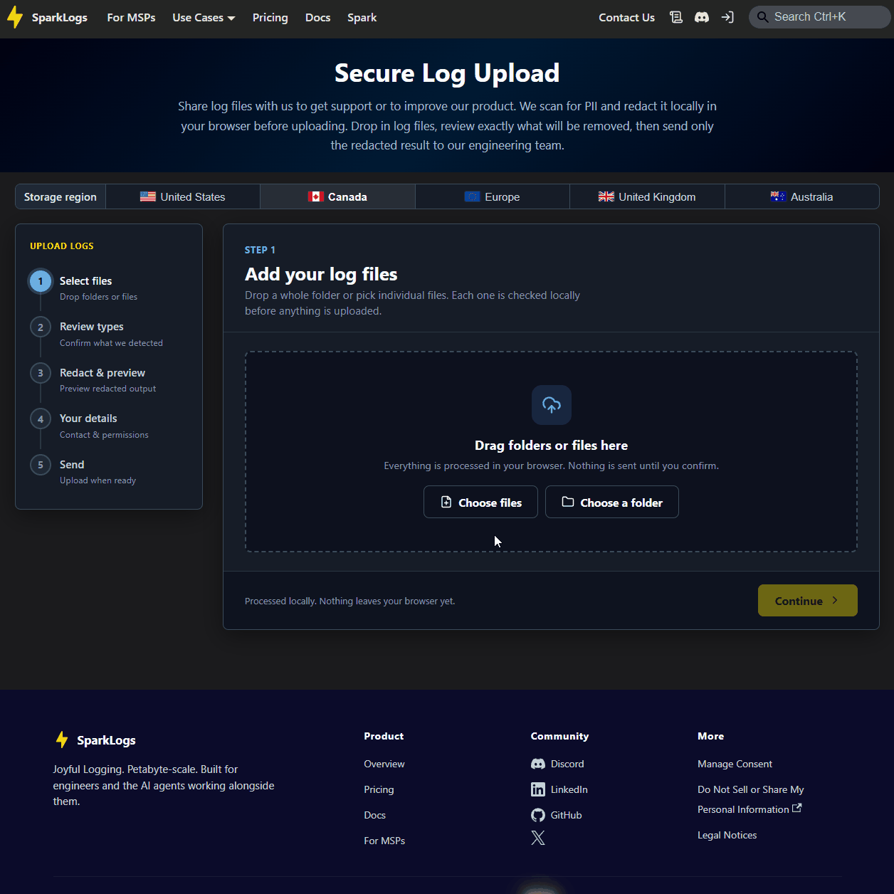

# sparklogs-redact

Detect and **pseudonymise PII in log text**. Replacements use consistent, format-shaped fakes so log
structure and correlations survive redaction. A **residual-PII scanner** flags anything that still
looks like real PII, useful as a CI gate before you share fixtures or upload samples.



Three npm packages share one version: a **browser-safe library**, a **CLI**, and a **React upload
wizard** (demo above). Built-in detectors cover usernames, SIDs, emails, hostnames, IPs, MACs, phones,
SSNs, credit cards, and API tokens/secrets. Extend via portable JSON detector specs.

## Install

```bash
npm install @sparklogs/redact-core    # library (Node or browser)
npm install @sparklogs/redact-cli     # CLI (command: sparklogs-redact)
npm install @sparklogs/redact-react   # React wizard (peers: react, react-dom)
```

| Package | npm | What it is |
|---|---|---|
| [`@sparklogs/redact-core`](packages/redact-core) | [npm](https://www.npmjs.com/package/@sparklogs/redact-core) | Detection + consistent-mapping engine + scanner. Zero runtime deps; safe in Node or the browser. |
| [`@sparklogs/redact-cli`](packages/redact-cli) | [npm](https://www.npmjs.com/package/@sparklogs/redact-cli) | `sparklogs-redact`: redact files or scan a tree for residual PII. Self-contained bundle. |
| [`@sparklogs/redact-react`](packages/redact-react) | [npm](https://www.npmjs.com/package/@sparklogs/redact-react) | In-browser **redact locally, then upload** wizard. Redacted content uploads only after user review and confirmation. |

Package READMEs: [core](packages/redact-core/README.md) · [cli](packages/redact-cli/README.md) · [react](packages/redact-react/README.md)

## Quick start

**CLI**: redact a file, then scan the output:

```bash
npx sparklogs-redact redact ./app.log -o app.redacted.log --stats
npx sparklogs-redact scan ./app.redacted.log    # exit 1 if residual PII found
npx sparklogs-redact profiles
```

**Library**: import in Node or a bundler:

```ts
import { Redactor, loadProfile } from "@sparklogs/redact-core";
const result = new Redactor(loadProfile("windows-log")).redact(logText);
```

**React**: upload wizard; see [`@sparklogs/redact-react`](packages/redact-react/README.md).

## Limitations

- **Pseudonymization, not anonymization**: consistent fakes preserve structure and correlations; a clean `scan` does not mean safe to publish without review.
- **Regex-based**: false negatives/positives depend on which profile(s) you use and log shape; built-in profiles also omit some patterns on purpose (e.g. `windows-log` does not redact IPv4).
- Not legal/compliance advice.

Package-specific caveats: [core](packages/redact-core/README.md#limitations) · [cli](packages/redact-cli/README.md#limitations) · [react](packages/redact-react/README.md#limitations)

## Contributing

This repo is an npm-workspaces monorepo: core, CLI, and React share detection specs and are versioned
in lockstep so a browser bundle of the core never pulls in Node built-ins.

### Versioning

All publishable packages share **one semver** and are bumped together on release. Never bump a single
package version; run `make check-versions` after version or changelog edits.

- **Minor** (`0.1.0` → `0.2.0`): backward-compatible API or notable features.
- **Patch**: bug fixes, no public API change.
- **Major** (or pre-1.0 minor when breaking): incompatible API changes.

Each package has a `CHANGELOG.md`. During development, edit **`## Unreleased`** in the package(s) you
changed; either **all three** changelogs have that section or **none** do (release PR). On release,
move `## Unreleased` → `## X.Y.Z` in every changelog (packages with no functional change get a
lockstep stub line), set all `package.json` versions to `X.Y.Z`, and set `@sparklogs/redact-core` in
cli/react to `^X.Y.Z`.

CI runs `make check-versions` (`scripts/check-lockstep-versions.mjs`) to enforce lockstep versions,
core dependency ranges, and changelog symmetry.

### Develop

```bash
npm install              # link workspaces + install dev tooling (tsup, typescript)
npm run build            # build core, cli, react -> packages/*/dist
npm test                 # run each package's test suite (node --test)
npm run typecheck        # tsc --noEmit in core, cli, and react
```

For a reproducible tree (same as CI), use `npm ci` instead of `npm install` when
`package-lock.json` is present.

### CI

```bash
make ci    # npm ci · build · typecheck · test · audit · smoke · check-versions
```

`make ci` installs all workspaces, builds every package, typechecks core/cli/react, runs all package
tests, runs `npm audit` (fails on high/critical in **production** deps only), smoke-tests the CLI
bundle, and verifies lockstep versions plus changelog conventions.

On pull requests, the workflow posts a sticky summary comment (see
[`.github/workflows/ci.yml`](.github/workflows/ci.yml)). Synthetic clean fixtures for `scan` live
under [`test/fixtures/clean/`](test/fixtures/clean/) (`*.fixture` synthetic logs; never commit raw
customer `*.log` files; see that directory's README).

## License

[MIT](LICENSE)
